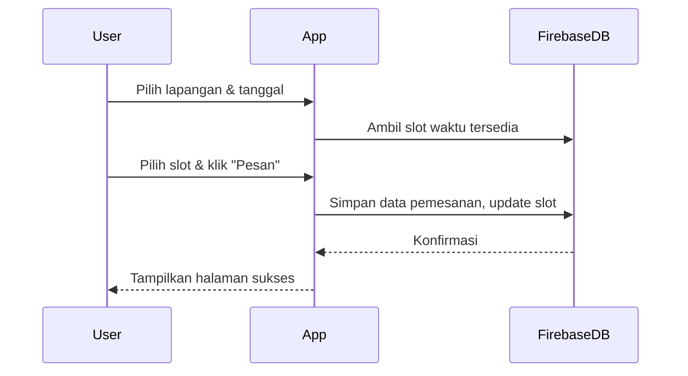

# Software Requirements Specification (SRS) - MVP Aplikasi Pemesanan Lapangan Olahraga di Angkasa Sport Center Batealit (MyAngkasa)

**Versi:** 1.0  
**Tanggal:** 25 Mei 2025  
**Penyusun:** [M. Gilang M.W. Sabdokafi]
**NIM:** [221240001248]

## 1. Pendahuluan

### 1.1 Tujuan Proyek
Dokumen ini mendefinisikan kebutuhan Minimum Viable Product (MVP) dari aplikasi mobile pemesanan lapangan olahraga (futsal, tenis, badminton, dll) yang memungkinkan pengguna untuk:
- Melihat ketersediaan lapangan secara real-time,
- Melakukan reservasi dan pembayaran,
- Menerima notifikasi pengingat dan konfirmasi.

### 1.2 Lingkup MVP
Lingkup MVP mencakup:
- Registrasi & login pengguna
- Eksplorasi lapangan berdasarkan lokasi & jenis olahraga
- Detail lapangan & jam ketersediaan
- Pemesanan lapangan & histori pemesanan
- Notifikasi pemesanan
- Admin dapat mengatur jadwal dan ketersediaan lapangan

Fitur yang tidak termasuk:
- Pembayaran online (digantikan dengan simulasi pembayaran)
- Chat langsung dengan pengelola
- Integrasi kalender eksternal

### 1.3 Pengguna Target & Peran
1. **Pengguna Umum**
   - Mendaftar, login, dan memesan lapangan
   - Melihat histori pemesanan
2. **Admin Lapangan**
   - Menambahkan, mengedit lapangan
   - Mengatur jam operasional dan slot tersedia
   - Melihat daftar pemesanan

## 2. Kebutuhan Fungsional

### 2.1 Autentikasi
- **AUTH-001:** Pengguna dapat mendaftar dan login menggunakan email/password
- **AUTH-002:** Sistem mengelola role pengguna (user/admin)

### 2.2 Eksplorasi Lapangan
- **EXP-001:** Pengguna dapat melihat daftar lapangan berdasarkan lokasi
- **EXP-002:** Pengguna dapat memfilter lapangan berdasarkan jenis olahraga

### 2.3 Detail Lapangan
- **DET-001:** Sistem menampilkan informasi detail lapangan: nama, lokasi, harga/jam, foto
- **DET-002:** Sistem menampilkan slot waktu yang tersedia berdasarkan tanggal

### 2.4 Pemesanan
- **ORD-001:** Pengguna dapat memilih tanggal dan jam lalu melakukan pemesanan
- **ORD-002:** Sistem menyimpan data pemesanan dan memperbarui slot tersedia
- **ORD-003:** Pengguna dapat melihat histori pemesanan

### 2.5 Manajemen Lapangan (Admin)
- **ADM-001:** Admin dapat menambahkan/edit lapangan
- **ADM-002:** Admin dapat mengatur jam operasional dan slot
- **ADM-003:** Admin melihat daftar reservasi yang masuk

## 3. Kebutuhan Non-Fungsional

- **NF-SEC-001:** Autentikasi aman (gunakan Firebase Auth)
- **NF-RT-001:** Perubahan ketersediaan slot ditampilkan secara real-time (Firebase Realtime DB)
- **NF-UX-001:** UI/UX bersih, intuitif
- **NF-BKP-001:** Data disimpan dan dibackup menggunakan Firebase

## 4. Model Data Awal

```mermaid
erDiagram
    USERS {
        string id
        string name
        string email
        string role
    }
    COURTS {
        string id
        string name
        string sport_type
        string location
        string price_per_hour
        string admin_id
    }
    BOOKINGS {
        string id
        string user_id
        string court_id
        datetime date
        string time_slot
        string status
    }

    USERS ||--o{ BOOKINGS : membuat
    COURTS ||--o{ BOOKINGS : dipesan
    USERS ||--o{ COURTS : mengelola

## 5. Alur Pengguna Utama

### 5.1 Registrasi & Login

```mermaid
sequenceDiagram
    participant User
    participant App
    participant FirebaseAuth

    User->>App: Buka halaman login
    App->>FirebaseAuth: Verifikasi email & password
    FirebaseAuth-->>App: Token login & user role
    App-->>User: Redirect ke dashboard sesuai role
```

### 5.2 Pemesanan Lapangan

