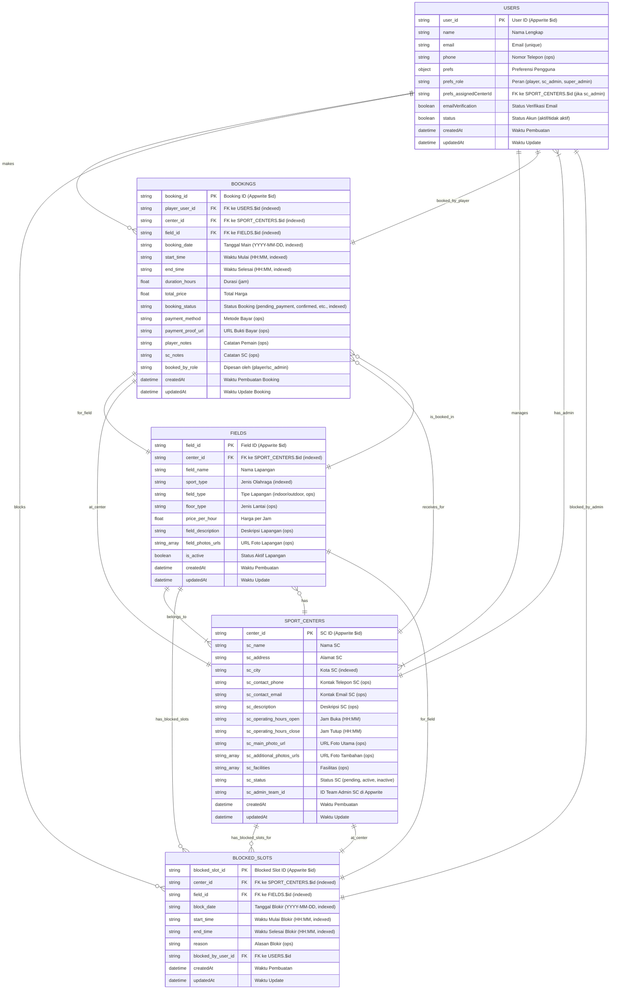

# Software Requirements Specification (SRS)
## Aplikasi SaaS Pemesanan Lapangan Olahraga "Gsports" (MVP)

**Versi:** 1.1
**Tanggal:** 14 Juli 2025 (Diperbarui)
**Penyusun:** [M. Gilang M.W. Sabdokafi - 221240001248]
[Arrayyan Rizqy Fawwaz - 221240001274]
[Umi Nurul Latifah - 221240001226]
---

## 1. Pendahuluan

### 1.1. Tujuan (TUJ001)
Dokumen ini bertujuan untuk mendefinisikan kebutuhan fungsional dan non-fungsional untuk Minimum Viable Product (MVP) dari aplikasi SaaS pemesanan dan manajemen ketersediaan lapangan olahraga. Aplikasi ini akan memungkinkan pengguna (pemain) untuk mencari, melihat ketersediaan, dan memesan lapangan secara real-time, serta memungkinkan admin Sports Center (SC) untuk mengelola lapangan dan pemesanan mereka secara terisolasi (multi-tenant).

### 1.2. Ruang Lingkup MVP (RLG001)
MVP akan fokus pada fungsionalitas inti berikut:
*   (F001) Registrasi dan login untuk pemain dan admin SC.
*   (F002) Pencarian lapangan berdasarkan jenis olahraga dan kota.
*   (F003) Tampilan detail SC dan lapangan (termasuk harga dan foto).
*   (F004) Tampilan ketersediaan slot lapangan secara real-time.
*   (F005) Proses pemesanan dasar oleh pemain (opsi pembayaran awal: konfirmasi tanpa pembayaran online / transfer bank manual).
*   (F006) Manajemen profil SC dasar oleh admin SC.
*   (F007) Manajemen lapangan (tambah/edit/hapus) oleh admin SC.
*   (F008) Manajemen jadwal dan ketersediaan manual oleh admin SC (blokir slot, tambah booking manual).
*   (F009) Tampilan daftar pemesanan untuk pemain dan admin SC.
*   (F010) (Jika transfer manual) Konfirmasi pembayaran oleh admin SC.
*   (F011) Manajemen dasar tenant (Sports Center) oleh Admin Platform.

### 1.3. Definisi, Akronim, dan Singkatan (DEF001)
*   **SC:** Sports Center (Pusat Olahraga)
*   **MVP:** Minimum Viable Product
*   **SRS:** Software Requirements Specification
*   **UI:** User Interface
*   **UX:** User Experience
*   **BaaS:** Backend as a Service
*   **API:** Application Programming Interface
*   **SDK:** Software Development Kit
*   **PK:** Primary Key
*   **FK:** Foreign Key

---

## 2. Deskripsi Umum

### 2.1. Perspektif Produk (DPP001)
Aplikasi ini adalah platform SaaS multi-tenant yang menghubungkan pemain dengan penyedia lapangan olahraga. Pemain dapat dengan mudah menemukan dan memesan lapangan, sementara SC mendapatkan alat untuk mengelola operasional pemesanan mereka secara digital dengan data yang terisolasi untuk setiap SC.

### 2.2. Pengguna Target (DPT001)
1.  **Pemain/Penyewa Lapangan (USR_PLAYER):** Individu atau grup yang ingin mencari dan menyewa lapangan olahraga.
2.  **Admin Sports Center (USR_ADMIN_SC):** Pemilik atau staf yang bertanggung jawab mengelola operasional dan pemesanan lapangan di SC mereka.
3.  **Admin Platform (USR_SUPER_ADMIN):** Anda/tim Anda, yang mengelola SC terdaftar, pengguna, dan operasional platform secara keseluruhan.

### 2.3. Teknologi yang Digunakan (TEK001)
*   **Frontend (Aplikasi Mobile):**
    *   **Framework:** Flutter (Target: Android & iOS)
    *   **Bahasa:** Dart
    *   **Manajemen State:** (Pilih salah satu, misal: Provider, BLoC/Cubit, Riverpod)
    *   **Routing:** (Navigator 2.0 atau package seperti go_router)
    *   **HTTP Client:** `http` package atau `dio`
    *   **SDK Appwrite:** `appwrite` package untuk Flutter
*   **Backend (BaaS):**
    *   **Platform:** Appwrite (Self-hosted atau Cloud jika tersedia dan sesuai)
    *   **Database:** Appwrite Database (NoSQL, berbasis dokumen)
    *   **Otentikasi:** Appwrite Authentication (Email/Password, OAuth2 opsional di masa depan)
    *   **Penyimpanan File:** Appwrite Storage (Untuk gambar, bukti bayar)
    *   **Realtime:** Appwrite Realtime (Untuk update ketersediaan)
    *   **Serverless Functions:** Appwrite Functions (Dart, Node.js, Python, dll. - untuk logika backend, validasi, otomatisasi)
*   **Desain & Prototyping (Opsional):** Figma, Adobe XD
*   **Version Control:** Git (misal: GitHub, GitLab, Bitbucket)
*   **Project Management:** (misal: Trello, Jira, Asana)

---

## 3. Kebutuhan Fungsional (MVP)

### 3.1. Fitur Untuk Pengguna (Pemain & Admin SC)

**3.1.1. (F001) Registrasi & Login Pengguna**
*   **ID Fitur:** F001
*   **Peran:** USR_PLAYER, USR_ADMIN_SC (calon)
*   **User Story:**
    *   (US001) "Sebagai pengguna baru, saya ingin bisa mendaftar menggunakan nama, email, dan password agar dapat menggunakan fitur aplikasi sesuai peran saya."
    *   (US002) "Sebagai pengguna terdaftar, saya ingin bisa login ke akun saya menggunakan email dan password."
    *   (US003) "Sebagai pengguna, saya ingin bisa logout dari akun saya."
*   **Alur Sistem & Pengguna:**

    **Alur Registrasi (AS001):**
    ```mermaid
    sequenceDiagram
        participant P as Pengguna
        participant App as Aplikasi (Flutter)
        participant API as Appwrite API

        P->>App: Buka Aplikasi, Pilih "Daftar"
        App->>P: Tampilkan Form Registrasi (Nama, Email, Password, Konfirmasi Pass, Pilih Peran [Player/Calon Admin SC])
        P->>App: Isi Form, Submit
        App->>API: Request `account.create()` dengan data pengguna & peran awal
        API-->>App: Respons Sukses (user object) / Error
        alt Sukses
            App->>P: Tampilkan Pesan Sukses, Arahkan ke Login / Dashboard
        else Error
            App->>P: Tampilkan Pesan Error (misal: email sudah ada)
        end
    ```

    **Alur Login (AS002):**
    ```mermaid
    sequenceDiagram
        participant P as Pengguna
        participant App as Aplikasi (Flutter)
        participant API as Appwrite API

        P->>App: Buka Aplikasi, Pilih "Login"
        App->>P: Tampilkan Form Login (Email, Password)
        P->>App: Isi Form, Submit
        App->>API: Request `account.createEmailSession()`
        API-->>App: Respons Sukses (session object) / Error
        alt Sukses
            App->>API: Request `account.get()` (untuk data user detail, termasuk peran)
            API-->>App: User data
            App->>P: Arahkan ke Dashboard sesuai peran
        else Error
            App->>P: Tampilkan Pesan Error (misal: email/password salah)
        end
    ```

    **Alur Logout (AS003):**
    ```mermaid
    sequenceDiagram
        participant P as Pengguna
        participant App as Aplikasi (Flutter)
        participant API as Appwrite API

        P->>App: Pilih Opsi "Logout"
        App->>API: Request `account.deleteSession('current')`
        API-->>App: Respons Sukses / Error
        App->>P: Arahkan ke Halaman Login
    ```
*   **Kriteria Penerimaan (KP001):**
    *   Pengguna berhasil membuat akun baru dan data tersimpan di collection `users` dengan peran yang sesuai.
    *   Pengguna berhasil login dengan kredensial yang valid dan sesi dibuat.
    *   Pengguna berhasil logout dan sesi dihapus.
    *   Notifikasi error jelas ditampilkan jika registrasi/login gagal.
    *   Password disimpan terenkripsi (dikelola Appwrite).
    *   Calon Admin SC mendaftar dengan peran sementara (misal, `pending_sc_admin`) yang perlu approval dari USR_SUPER_ADMIN.

---

*(Lanjutkan format serupa untuk fitur F002 hingga F011, termasuk User Story, Alur Sistem dengan diagram Mermaid, dan Kriteria Penerimaan. Saya akan memberikan contoh untuk beberapa fitur lagi dan Anda bisa mengembangkannya)*

---

**3.1.2. (F002) Pencarian Lapangan Dasar**
*   **ID Fitur:** F002
*   **Peran:** USR_PLAYER
*   **User Story:**
    *   (US004) "Sebagai pemain, saya ingin mencari SC berdasarkan jenis olahraga (misal: futsal, badminton) dan kota agar menemukan pilihan yang relevan."
    *   (US005) "Sebagai pemain, saya ingin melihat daftar SC yang cocok dengan kriteria pencarian saya."
*   **Alur Sistem & Pengguna (AS004):**
    ```mermaid
    sequenceDiagram
        participant P as Pemain
        participant App as Aplikasi (Flutter)
        participant API as Appwrite API

        P->>App: Di halaman utama, input/pilih jenis olahraga & input kota
        App->>App: Validasi input
        App->>API: Request `databases.listDocuments('sport_centers')` dengan filter (query) berdasarkan kota DAN join/lookup ke `fields` untuk filter jenis olahraga.
        API-->>App: Daftar SC yang cocok / Daftar Kosong / Error
        alt Ditemukan
            App->>P: Tampilkan daftar SC (Nama, Alamat singkat, mungkin 1 foto utama)
        else Tidak Ditemukan
            App->>P: Tampilkan pesan "Tidak ada SC ditemukan"
        end
    ```
*   **Kriteria Penerimaan (KP002):**
    *   Hasil pencarian menampilkan daftar SC yang aktif dan sesuai dengan kriteria jenis olahraga dan kota.
    *   Jika tidak ada hasil, pesan informatif ditampilkan.
    *   Pencarian efisien (memanfaatkan indeks di Appwrite).

**3.1.3. (F003) Tampilan Detail Sports Center & Lapangan**
*   **ID Fitur:** F003
*   **Peran:** USR_PLAYER
*   **User Story:**
    *   (US006) "Sebagai pemain, saya ingin memilih SC dari hasil pencarian untuk melihat detail lengkapnya (alamat, kontak, foto, jam operasional, daftar lapangan)."
    *   (US007) "Sebagai pemain, saya ingin memilih lapangan dari daftar di SC untuk melihat detailnya (nama, jenis, harga per jam, deskripsi, foto)."
*   **Alur Sistem & Pengguna (AS005):**
    ```mermaid
    sequenceDiagram
        participant P as Pemain
        participant App as Aplikasi (Flutter)
        participant API as Appwrite API

        P->>App: Pilih SC dari daftar hasil pencarian
        App->>API: Request `databases.getDocument('sport_centers', centerId)`
        API-->>App: Detail SC
        App->>API: Request `databases.listDocuments('fields')` dengan filter `centerId`
        API-->>App: Daftar lapangan untuk SC tersebut
        App->>P: Tampilkan halaman detail SC (info, foto SC, daftar lapangan [nama, jenis, harga singkat])

        P->>App: Pilih satu lapangan dari daftar
        App->>API: Request `databases.getDocument('fields', fieldId)`
        API-->>App: Detail lapangan
        App->>P: Tampilkan halaman detail lapangan (info lengkap, harga, deskripsi, foto lapangan)
    ```
*   **Kriteria Penerimaan (KP003):**
    *   Informasi detail SC dan lapangan ditampilkan akurat dan lengkap sesuai data di backend.
    *   Foto-foto (jika ada) ditampilkan dengan benar.
    *   Harga lapangan jelas terlihat.

**3.1.4. (F004) Tampilan Ketersediaan Real-time Sederhana**
*   **ID Fitur:** F004
*   **Peran:** USR_PLAYER
*   **User Story:**
    *   (US008) "Sebagai pemain, di halaman detail lapangan, saya ingin memilih tanggal dan melihat jadwal ketersediaan slot waktu secara real-time (tersedia/dipesan)."
*   **Alur Sistem & Pengguna (AS006):**
    ```mermaid
    sequenceDiagram
        participant P as Pemain
        participant App as Aplikasi (Flutter)
        participant API as Appwrite API (Database & Realtime)

        P->>App: Di halaman detail lapangan, pilih tanggal
        App->>API: Request `databases.listDocuments('bookings')` dengan filter `fieldId` dan rentang `bookingDate` (untuk tanggal dipilih).
        API-->>App: Daftar booking yang ada untuk tanggal & lapangan tsb.
        App->>App: Proses data booking, tentukan slot tersedia/dipesan (misal per jam dari jam buka-tutup SC)
        App->>P: Tampilkan kalender/jadwal slot waktu dengan statusnya.
        App->>API: Subscribe ke event Realtime untuk collection `bookings` dengan filter `fieldId` dan `bookingDate`.
        Note over API,App: Jika ada booking baru/perubahan status di `bookings` untuk field & tanggal ini...
        API->>App: Kirim update Realtime.
        App->>App: Update UI jadwal ketersediaan.
        App->>P: (UI Terupdate)
    ```
*   **Kriteria Penerimaan (KP004):**
    *   Jadwal ketersediaan slot akurat berdasarkan data `bookings`.
    *   Perubahan ketersediaan (booking baru, blokir oleh admin) tercermin di UI pemain dengan cepat (< 5-10 detik) tanpa perlu refresh manual.
    *   Slot yang di luar jam operasional SC tidak ditampilkan sebagai tersedia.

---
*(Lanjutkan untuk F005 - F011 dengan detail serupa)*
---

## 4. Kebutuhan Non-Fungsional (KNF)

*   **KNF001: Kinerja (Performance)**
    *   **KNF001.1:** Waktu respons aplikasi untuk aksi pengguna umum (navigasi, buka halaman) harus < 2 detik.
    *   **KNF001.2:** Waktu muat daftar SC (hasil pencarian) harus < 3 detik untuk 20 hasil pertama.
    *   **KNF001.3:** Waktu muat tampilan ketersediaan lapangan (setelah pilih tanggal) harus < 3 detik.
    *   **KNF001.4:** Penggunaan CPU dan memori aplikasi di perangkat mobile harus efisien.
*   **KNF002: Ketersediaan Real-time (Real-time Availability)**
    *   **KNF002.1:** Update perubahan status ketersediaan slot lapangan di semua klien yang relevan harus terjadi dalam < 5 detik (ideal < 2 detik) setelah perubahan di backend.
*   **KNF003: Keamanan (Security)**
    *   **KNF003.1:** Otentikasi pengguna menggunakan mekanisme aman yang disediakan Appwrite (password hashing, session management).
    *   **KNF003.2:** Otorisasi: Data hanya dapat diakses dan dimodifikasi oleh pengguna dengan peran dan hak yang sesuai (Pemain, Admin SC spesifik, Super Admin). Isolasi data tenant (SC) harus ketat.
    *   **KNF003.3:** Perlindungan terhadap serangan umum (misal: XSS, SQL Injection – sebagian besar ditangani BaaS, namun validasi input tetap penting).
    *   **KNF003.4:** Komunikasi antara aplikasi klien dan Appwrite harus melalui HTTPS.
    *   **KNF003.5:** API Key (jika digunakan untuk Functions atau server-to-server) harus disimpan aman dan memiliki scope terbatas.
*   **KNF004: Usability (Kemudahan Penggunaan)**
    *   **KNF004.1:** Antarmuka pengguna (UI) harus intuitif, konsisten, dan mudah dipahami oleh pengguna target tanpa memerlukan pelatihan khusus.
    *   **KNF004.2:** Alur kerja utama (pencarian, pemesanan, manajemen SC) harus efisien dan minim langkah yang tidak perlu.
    *   **KNF004.3:** Pesan error dan feedback sistem harus jelas dan informatif.
    *   **KNF004.4:** Aplikasi harus mendukung orientasi potret.
*   **KNF005: Stabilitas & Keandalan (Stability & Reliability)**
    *   **KNF005.1:** Aplikasi harus stabil dan memiliki Mean Time Between Failures (MTBF) yang tinggi. Target crash rate < 0.1%.
    *   **KNF005.2:** Data yang disimpan di backend harus persisten dan tidak hilang akibat error aplikasi.
    *   **KNF005.3:** Proses pemesanan harus transaksional (atau setidaknya mendekati, memastikan slot terblokir dengan benar saat dipesan).
*   **KNF006: Skalabilitas (Awal) (Scalability - Initial)**
    *   **KNF006.1:** Arsitektur backend (Appwrite) harus mampu menangani pertumbuhan pengguna dan SC hingga (misalnya) 100 SC dan 1000 pengguna aktif harian untuk fase MVP tanpa degradasi performa signifikan.
    *   **KNF006.2:** Desain database harus mempertimbangkan query yang efisien seiring pertumbuhan data.
*   **KNF007: Maintainability (Kemudahan Pemeliharaan)**
    *   **KNF007.1:** Kode sumber (Flutter & Appwrite Functions) harus terstruktur dengan baik, mudah dipahami, dan mengikuti best practices untuk memudahkan modifikasi dan penambahan fitur di masa depan.
    *   **KNF007.2:** Dokumentasi kode (komentar) yang memadai.
*   **KNF008: Kompatibilitas (Compatibility)**
    *   **KNF008.1:** Aplikasi Flutter harus kompatibel dengan Android versi 6.0 (Marshmallow) ke atas.
    *   **KNF008.2:** Aplikasi Flutter harus kompatibel dengan iOS versi 12.0 ke atas.
    *   **KNF008.3:** Tampilan harus responsif terhadap berbagai ukuran layar ponsel umum.
*   **KNF009: Lokalizasi (Localization - Awal)**
    *   **KNF009.1:** Teks antarmuka pengguna utama akan menggunakan Bahasa Indonesia. (Dukungan multi-bahasa bisa jadi fitur masa depan).
*   **KNF010: Data Management & Backup**
    *   **KNF010.1:** Admin Platform harus memiliki mekanisme untuk backup data penting dari Appwrite secara periodik (jika self-hosted, atau memahami kebijakan backup penyedia cloud Appwrite).
    *   **KNF010.2:** Kebijakan retensi data (jika diperlukan) harus didefinisikan.

---

## 5. Skema Database Detail (Appwrite Collections) (DB001)


**Aturan Umum Permissions:**
*   **`role:super_admin`**: Biasanya memiliki CRUD penuh pada semua collection untuk keperluan administrasi.
*   **`team:sc_[centerId]_admins`**: Tim yang berisi ID user admin dari SC tertentu. Digunakan untuk memberikan akses CRUD ke data milik SC tersebut.
*   **`user:[userId]`**: Memberikan akses kepada pengguna spesifik (pemilik dokumen).
*   **`role:player`**: Memberikan akses baca umum atau hak buat terbatas.

---

**5.1. Collection: `users`**
*   **Tujuan:** Menyimpan data semua pengguna (Pemain, Admin SC, Super Admin).
*   **Atribut:**
    *   `$id` (string, PK, otomatis oleh Appwrite): ID unik pengguna.
    *   `$createdAt` (datetime, otomatis): Waktu pembuatan.
    *   `$updatedAt` (datetime, otomatis): Waktu update terakhir.
    *   `name` (string, wajib): Nama lengkap pengguna.
    *   `email` (string, wajib, unik, indexed): Alamat email pengguna (untuk login).
    *   `emailVerification` (boolean, otomatis): Status verifikasi email.
    *   `password` (string, otomatis, hashed): Password pengguna (dikelola Appwrite).
    *   `phone` (string, opsional): Nomor telepon pengguna.
    *   `prefs` (object, otomatis): Preferensi pengguna (bisa berisi `role` dan `assignedCenterId`).
        *   `role` (string, wajib, enum: `player`, `pending_sc_admin`, `sc_admin`, `super_admin`): Peran pengguna dalam sistem.
        *   `assignedCenterId` (string, opsional, FK ke `sport_centers.$id`): Diisi jika `role` adalah `sc_admin`, menunjukkan SC yang dikelola.
    *   `status` (boolean, otomatis): Status akun (aktif/tidak aktif).
*   **Permissions Dokumen Default:**
    *   Read: `role:super_admin`, `user:$id`
    *   Update: `role:super_admin`, `user:$id` (Pengguna bisa update profil sendiri)
    *   Delete: `role:super_admin`
*   **Relasi:**
    *   `prefs.assignedCenterId` -> `sport_centers.$id` (Satu Admin SC mengelola satu SC - untuk MVP).

---

**5.2. Collection: `sport_centers` (SC)**
*   **Tujuan:** Menyimpan data detail setiap Sports Center (tenant).
*   **Atribut:**
    *   `$id` (string, PK, otomatis): ID unik SC.
    *   `$createdAt` (datetime, otomatis): Waktu pembuatan.
    *   `$updatedAt` (datetime, otomatis): Waktu update terakhir.
    *   `sc_name` (string, wajib, indexed): Nama resmi Sports Center.
    *   `sc_address` (string, wajib): Alamat lengkap SC.
    *   `sc_city` (string, wajib, indexed): Kota lokasi SC (untuk pencarian).
    *   `sc_contact_phone` (string, opsional): Nomor telepon kontak SC.
    *   `sc_contact_email` (string, opsional): Email kontak SC.
    *   `sc_description` (string, opsional, teks panjang): Deskripsi tentang SC.
    *   `sc_operating_hours_open` (string, wajib, format "HH:MM"): Jam buka SC.
    *   `sc_operating_hours_close` (string, wajib, format "HH:MM"): Jam tutup SC.
    *   `sc_main_photo_url` (string, opsional): URL ke foto utama SC (dari Appwrite Storage).
    *   `sc_additional_photos_urls` (array of strings, opsional): Daftar URL ke foto tambahan SC.
    *   `sc_facilities` (array of strings, opsional): Daftar fasilitas (misal: "Parkir", "Toilet", "Kantin").
    *   `sc_status` (string, wajib, enum: `pending_approval`, `active`, `inactive`, `suspended`, indexed): Status SC.
    *   `sc_admin_team_id` (string, wajib): ID Team Appwrite (`sc_[$id]_admins`) yang berisi admin(s) untuk SC ini.
*   **Permissions Dokumen Default:**
    *   Read: `role:super_admin`, `role:player`, `team:[sc_admin_team_id]`
    *   Create: `role:super_admin` (atau Function yang dipicu oleh `pending_sc_admin` yang disetujui)
    *   Update: `role:super_admin`, `team:[sc_admin_team_id]`
    *   Delete: `role:super_admin`
*   **Relasi:**
    *   Memiliki banyak `fields`.
    *   Dikelola oleh pengguna dalam `team:[sc_admin_team_id]`.

---

**5.3. Collection: `fields` (Lapangan)**
*   **Tujuan:** Menyimpan data detail setiap lapangan milik Sports Center.
*   **Atribut:**
    *   `$id` (string, PK, otomatis): ID unik lapangan.
    *   `$createdAt` (datetime, otomatis): Waktu pembuatan.
    *   `$updatedAt` (datetime, otomatis): Waktu update terakhir.
    *   `center_id` (string, wajib, FK ke `sport_centers.$id`, indexed): ID SC pemilik lapangan ini.
    *   `field_name` (string, wajib): Nama lapangan (misal: "Lapangan Futsal A", "Badminton Indoor 1").
    *   `sport_type` (string, wajib, enum: `futsal`, `badminton`, `basketball`, `volleyball`, `tennis`, indexed): Jenis olahraga utama lapangan.
    *   `field_type` (string, opsional, enum: `indoor`, `outdoor`): Jenis lapangan (indoor/outdoor).
    *   `floor_type` (string, opsional): Jenis lantai (misal: "Sintetis", "Vinyl", "Semen").
    *   `price_per_hour` (number, wajib, float): Harga sewa per jam.
    *   `field_description` (string, opsional): Deskripsi singkat lapangan.
    *   `field_photos_urls` (array of strings, opsional): Daftar URL ke foto-foto lapangan.
    *   `is_active` (boolean, wajib, default: true): Status aktif/tidak aktif lapangan.
*   **Permissions Dokumen Default:**
    *   Read: `role:super_admin`, `role:player`, `team:[center_id]_admins` (Asumsi Team ID mengikuti pola `sc_[center_id]_admins`)
    *   Create: `role:super_admin`, `team:[center_id]_admins`
    *   Update: `role:super_admin`, `team:[center_id]_admins`
    *   Delete: `role:super_admin`, `team:[center_id]_admins`
*   **Relasi:**
    *   Dimiliki oleh satu `sport_centers` (via `center_id`).
    *   Memiliki banyak `bookings`.
    *   Memiliki banyak `blocked_slots`.

---

**5.4. Collection: `bookings` (Pemesanan)**
*   **Tujuan:** Menyimpan data setiap transaksi pemesanan lapangan.
*   **Atribut:**
    *   `$id` (string, PK, otomatis): ID unik pemesanan.
    *   `$createdAt` (datetime, otomatis): Waktu pemesanan dibuat.
    *   `$updatedAt` (datetime, otomatis): Waktu update terakhir.
    *   `player_user_id` (string, wajib, FK ke `users.$id`, indexed): ID pengguna (pemain) yang memesan.
    *   `center_id` (string, wajib, FK ke `sport_centers.$id`, indexed): ID SC tempat lapangan dipesan (denormalisasi untuk query).
    *   `field_id` (string, wajib, FK ke `fields.$id`, indexed): ID lapangan yang dipesan.
    *   `booking_date` (string, wajib, format "YYYY-MM-DD", indexed): Tanggal bermain.
    *   `start_time` (string, wajib, format "HH:MM", indexed): Waktu mulai bermain.
    *   `end_time` (string, wajib, format "HH:MM", indexed): Waktu selesai bermain.
    *   `duration_hours` (number, wajib, float): Durasi sewa dalam jam.
    *   `total_price` (number, wajib, float): Total harga pemesanan.
    *   `booking_status` (string, wajib, enum: `pending_payment`, `confirmed`, `cancelled_by_player`, `cancelled_by_sc`, `completed`, `payment_rejected`, `waiting_for_sc_confirmation`, indexed): Status pemesanan.
    *   `payment_method` (string, opsional, enum: `on_the_spot`, `bank_transfer`): Metode pembayaran (untuk MVP).
    *   `payment_proof_url` (string, opsional): URL ke bukti pembayaran jika `bank_transfer`.
    *   `player_notes` (string, opsional): Catatan dari pemain.
    *   `sc_notes` (string, opsional): Catatan dari admin SC terkait booking ini.
    *   `booked_by_role` (string, wajib, enum: `player`, `sc_admin`): Siapa yang membuat booking (pemain atau admin SC untuk booking manual).
*   **Permissions Dokumen Default:**
    *   Read: `role:super_admin`, `user:[player_user_id]`, `team:[center_id]_admins`
    *   Create: `role:player`, `team:[center_id]_admins`
    *   Update: `role:super_admin`, `user:[player_user_id]` (hanya untuk status tertentu seperti `cancelled_by_player`), `team:[center_id]_admins` (untuk konfirmasi, pembatalan oleh SC)
    *   Delete: `role:super_admin` (pembatalan keras, jarang digunakan)
*   **Relasi:**
    *   Dibuat oleh satu `users` (pemain).
    *   Merujuk ke satu `fields` dan satu `sport_centers`.

---

**5.5. Collection: `blocked_slots` (Slot Waktu Diblokir Admin SC)**
*   **Tujuan:** Menyimpan informasi slot waktu yang diblokir oleh Admin SC (misal untuk maintenance, acara internal).
*   **Atribut:**
    *   `$id` (string, PK, otomatis): ID unik slot diblokir.
    *   `$createdAt` (datetime, otomatis): Waktu pembuatan.
    *   `$updatedAt` (datetime, otomatis): Waktu update terakhir.
    *   `center_id` (string, wajib, FK ke `sport_centers.$id`, indexed): ID SC.
    *   `field_id` (string, wajib, FK ke `fields.$id`, indexed): ID lapangan yang slotnya diblokir.
    *   `block_date` (string, wajib, format "YYYY-MM-DD", indexed): Tanggal slot diblokir.
    *   `start_time` (string, wajib, format "HH:MM", indexed): Waktu mulai blokir.
    *   `end_time` (string, wajib, format "HH:MM", indexed): Waktu selesai blokir.
    *   `reason` (string, opsional): Alasan pemblokiran slot.
    *   `blocked_by_user_id` (string, wajib, FK ke `users.$id`): ID Admin SC yang melakukan blokir.
*   **Permissions Dokumen Default:**
    *   Read: `role:super_admin`, `role:player` (aplikasi akan query ini untuk menentukan ketersediaan), `team:[center_id]_admins`
    *   Create: `role:super_admin`, `team:[center_id]_admins`
    *   Update: `role:super_admin`, `team:[center_id]_admins`
    *   Delete: `role:super_admin`, `team:[center_id]_admins`
*   **Relasi:**
    *   Merujuk ke satu `fields` dan satu `sport_centers`.
    *   Dibuat oleh satu `users` (Admin SC).

---

## 6. Pertimbangan Desain Antarmuka Pengguna (UI/UX) (UIX001)

*   **UIX001.1 Desain Bersih & Intuitif:** Mengutamakan kemudahan navigasi dan pemahaman. Tata letak yang jelas, penggunaan ikon yang familiar.
*   **UIX001.2 Mobile-First:** Desain dioptimalkan untuk pengalaman pengguna di perangkat mobile (Android & iOS).
*   **UIX001.3 Konsistensi:** Elemen UI (tombol, form, warna) dan alur kerja konsisten di seluruh aplikasi.
*   **UIX001.4 Feedback Visual:** Pengguna harus mendapatkan feedback visual yang jelas atas aksi mereka (misal: loading indicator, pesan sukses/error, animasi transisi halus).
*   **UIX001.5 Aksesibilitas Dasar:** Kontras warna yang baik (WCAG AA), ukuran font yang dapat disesuaikan (jika memungkinkan oleh OS), label yang jelas untuk elemen interaktif.
*   **UIX001.6 Alur Pemesanan Efisien:** Proses dari pencarian hingga konfirmasi booking harus sependek dan sejelas mungkin.
*   **UIX001.7 Tampilan Jadwal Interaktif:** Kalender atau tampilan slot waktu yang mudah digunakan untuk memilih jadwal.

---

## 7. Rencana Rilis (MVP) (RLS001)

Fokus rilis MVP adalah untuk meluncurkan fungsionalitas inti (F001-F011) dan kebutuhan non-fungsional dasar yang telah dijabarkan di atas. Setelah peluncuran, feedback dari pengguna awal (pemain dan SC) akan dikumpulkan secara aktif untuk iterasi dan pengembangan fitur selanjutnya (misal: pembayaran online terintegrasi, fitur membership, ulasan & rating, notifikasi push lebih canggih).

---
*Dokumen ini bersifat hidup dan dapat diperbarui seiring dengan perkembangan proyek.*
