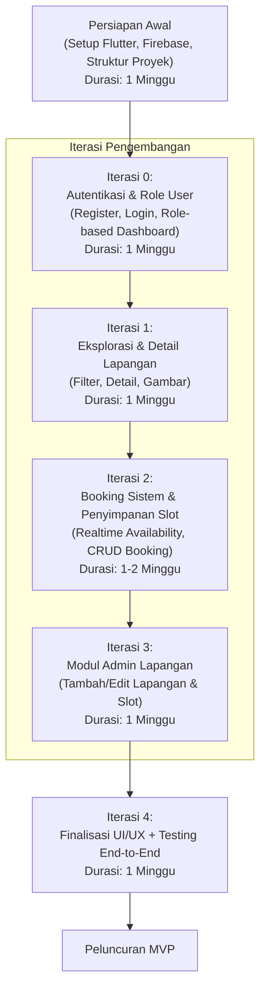

---
# Timeline Pengembangan MVP Aplikasi Booking Lapangan (MyAngkasa)

```mermaid
graph TD
    A0["Persiapan Awal\n(Setup Flutter, Firebase, Struktur Proyek)\nDurasi: 1 Minggu"] --> I0;

    subgraph "Iterasi Pengembangan"
        direction LR
        I0["Iterasi 0:\nAutentikasi & Role User\n(Register, Login, Role-based Dashboard)\nDurasi: 1 Minggu"] --> I1;
        I1["Iterasi 1:\nEksplorasi & Detail Lapangan\n(Filter, Detail, Gambar)\nDurasi: 1 Minggu"] --> I2;
        I2["Iterasi 2:\nBooking Sistem & Penyimpanan Slot\n(Realtime Availability, CRUD Booking)\nDurasi: 1-2 Minggu"] --> I3;
        I3["Iterasi 3:\nModul Admin Lapangan\n(Tambah/Edit Lapangan & Slot)\nDurasi: 1 Minggu"];
    end

    I3 --> I4["Iterasi 4:\nFinalisasi UI/UX + Testing End-to-End\nDurasi: 1 Minggu"];
    I4 --> MVP["Peluncuran MVP"];
```